  <h2>Shubh Srivastava</h2>
  
<strong>Computer Science Student | Problem Solver | Full-Stack Builder</strong>

  

    I build end-to-end systems with C++, Python, JavaScript, SQL, and React,
    with a strong interest in blockchain, cryptography, zero-knowledge proofs,
    machine learning, and secure scalable software.
  

  <h3><code>shubh@github ~ $ ./contributions.sh</code></h3>
  

    

  <h3><code>shubh@github ~ $ whoami</code></h3>
  <table>
    <tr>
      <td valign="top">
        
      </td>
      <td valign="top">
        
      </td>
    </tr>
  </table>

   

  

    
    
  

  
<em>I enjoy solving challenging problems and building systems that balance performance, security, and usability.</em>

